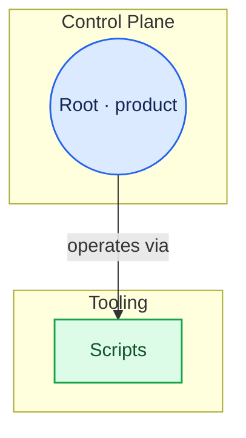

# Flow diagram — examples

## User prompts (apply the skill)

- “`/flow-diagram` refresh” or “`/flow-driagram`” (typo — treat as this skill).
- “Update the architecture Mermaid to match the repo.”
- “Sync `LAB_ARCHITECTURE_FLOWCHART.md` after we moved scripts / added `lab/` folders.”
- “GitDiagram-style flowchart for Lab OS, committed in docs.”

## Deliverable shape (canonical doc)

1. H1 title and short intro (living diagram, pointer to this skill, why **tables** replace `click` in Cursor).
2. One fenced code block, language `mermaid`: `flowchart TD`, subgraphs, edges, **`classDef` / `class`**, **no `click` lines**.
3. **Node lookup** table: Mermaid ID, role, repo path, GitHub link (`blob` / `tree`).
4. **Relationship lookup** table: from, relationship, to, solid vs dotted.
5. Optionally **What changed** bullets for PRs.

Inner diagram structure: subgraphs with `group_*` IDs, nodes with `node_*` IDs—match [EXAMPLE_FLOWCHART.md](../../../../docs/60-reference/EXAMPLE_FLOWCHART.md) for **colors and grouping**, not for `click` or ` ` (use **` · `** on one line for Cursor).

## Minimal Mermaid skeleton (expand from inventory)

After the fence, add a table row for `node_scripts` → `scripts/` → `https://github.com/OWNER/REPO/tree/main/scripts`.

Resolve `OWNER`, `REPO`, and `main` from `git remote get-url origin` (or user override).

## Anti-patterns

- Relying on Mermaid **`click`** as the only navigation in the canonical doc (breaks in Cursor).
- Inventing directories not in the tree to “look complete”.
- Using node IDs with spaces (`node validate` → use `node_validate`).
- Putting secrets in labels or URLs (tokens in query strings).

## Reference output

Full gitdiagram export with `click` (historical): [EXAMPLE_FLOWCHART.md](../../../../docs/60-reference/EXAMPLE_FLOWCHART.md).  
Maintained canonical (tables + no `click`): [LAB_ARCHITECTURE_FLOWCHART.md](../../../../docs/60-reference/LAB_ARCHITECTURE_FLOWCHART.md).
