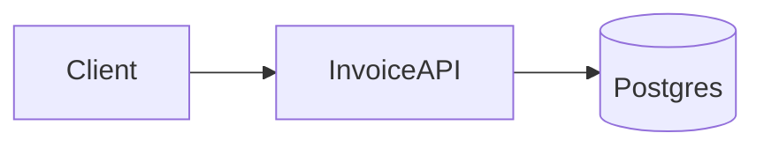
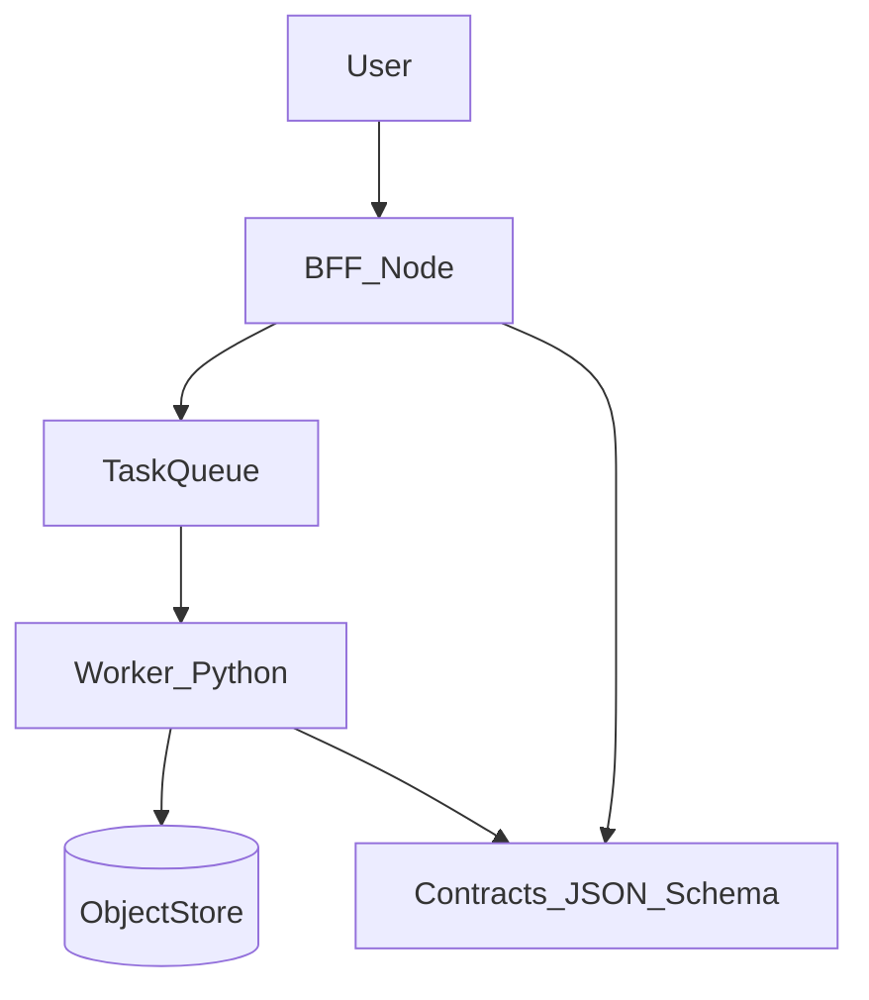
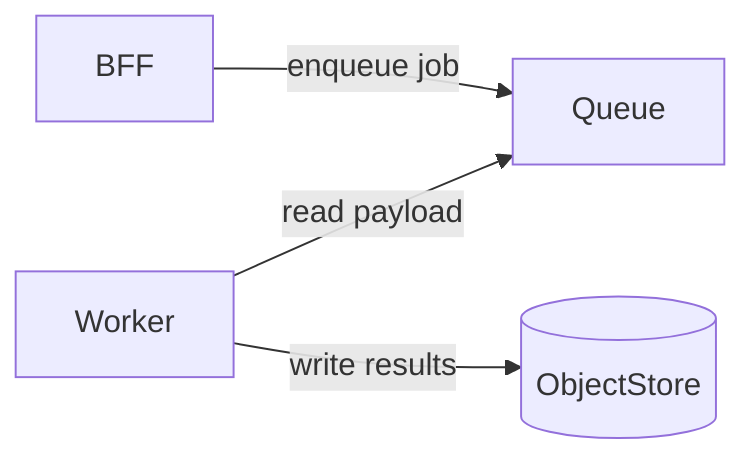
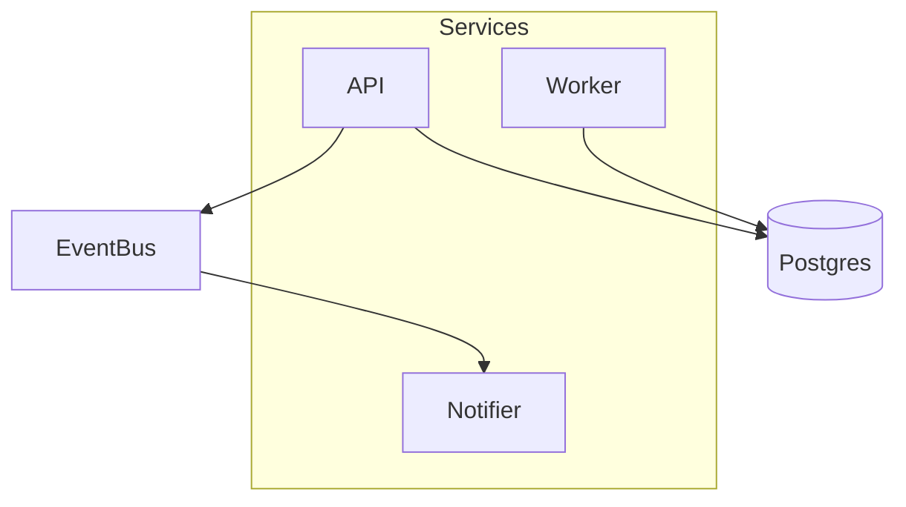

# Lab-init examples

Structure and index style are inspired by **directory tree + docs index** patterns (e.g. annotated `project-structure.md` and a `docs/README.md` table). Do not copy domain content from other projects.

---

## Example 1 — Phase A only (simple single-stack)

**Trigger:** `/lab-init` — user describes a single small API service.

### Design package (abbreviated)

**Profile:** One HTTP API, one database, one repo.

**Knowns:** REST API, Postgres, Docker for local dev.

**Unknowns:** Auth provider not chosen.

**Anchors:** Must run on Linux in prod; no secrets in repo.

**Phased plan:** local (Docker Compose) → staging → prod with migration gate.

**Validation gates:** unit tests, contract tests against DB, smoke on deploy.

### `docs/project-structure.md` (illustrative)

```text
invoice-api/
├── src/                    # Application code
│   ├── api/                # HTTP handlers
│   ├── domain/             # Core logic
│   └── adapters/           # DB, external clients
├── tests/
├── docker-compose.yml      # Local Postgres
├── docs/
│   ├── project-structure.md
│   ├── README.md
│   └── diagrams/
│       └── context.md      # Mermaid: service context
└── README.md
```

### Mermaid (one diagram is enough here)



### `docs/README.md` (mini-index)

| Doc | Purpose |
|-----|---------|
| project-structure.md | Directory tree |
| diagrams/context.md | Service context diagram |

**Phase A complete.** Proceed to sprout? **no** → stop; user can save files manually.

---

## Example 2 — Mixed Node + Python (Phase A + sprout handoff)

**Profile:** Node BFF + Python ML worker; shared `contracts/` for JSON schemas.

### ASCII tree (illustrative)

```text
data-pipeline/
├── bff-node/               # Node: HTTP + orchestration
├── worker-py/              # Python: batch + model inference
├── contracts/              # JSON Schema shared by both
├── infra/                  # Terraform or OpenTofu (optional)
├── docs/
│   ├── project-structure.md
│   ├── README.md
│   └── diagrams/
│       ├── services.md
│       └── data-flow.md
└── README.md
```

### Mermaid — service boundaries



### Mermaid — data flow (read path)



### Sprout handoff (Phase B)

```text
[Sprout handoff — paste into AI in data-pipeline/]
Target: ./data-pipeline
Mode: custom
Summary: Node BFF + Python worker; shared JSON Schema in contracts/; queue between them.
Authoritative docs: docs/project-structure.md, docs/diagrams/services.md, docs/diagrams/data-flow.md
Steps:
  1) Create bff-node and worker-py skeletons per tree; no prod deploy.
  2) Add contracts/schemas with shared IDs; validate in CI later.
  3) Wire local queue emulator or Docker Compose for dev.
Do not: commit secrets; point to prod queue before user confirms.
STOP before: terraform apply / cloud resources — confirm with user.
```

---

## Example 3 — Multi-service + infra (multiple diagrams + handoff)

**Profile:** API, worker, notifier; Terraform manages VPC + DB; promotion local → dev → prod.

### Mermaid — services



### Mermaid — promotion / environments


### Sprout handoff

```text
[Sprout handoff — paste into AI in platform/]
Target: ./platform
Mode: custom
Summary: Three services; shared Postgres; event bus; infra via OpenTofu; local compose first.
Authoritative docs: docs/project-structure.md, docs/diagrams/services.md, docs/diagrams/promotion.md
Steps:
  1) Stand up local compose for Postgres + bus stub.
  2) Implement API + worker read-only paths; then writes.
  3) Add notifier behind feature flag.
  4) OpenTofu: plan dev; apply only after user approval.
Do not: apply to prod; rotate keys in repo.
STOP before: tofu apply destroying resources; any prod traffic switch.
```

---

## Lab OS seed mode (`lab-os-seed`) — this repository only

When the open workspace is `lab-os-lab` and the user selects **sprout mode `lab-os-seed`** and confirms execution:

```bash
npm install
npm run lab:init -- ./.tmp/quickstart-lab
npm run lab:verify
```

Use the user’s chosen target path instead of `./.tmp/quickstart-lab` when agreed. Do **not** use this block for Python-only or unrelated projects unless the user explicitly wants Lab OS artifacts in this repo.

---

## Trigger phrases

- `/lab-init`
- `design and tailor this lab before we scaffold`
- `sprout the seed into <folder>` (after Phase A)
