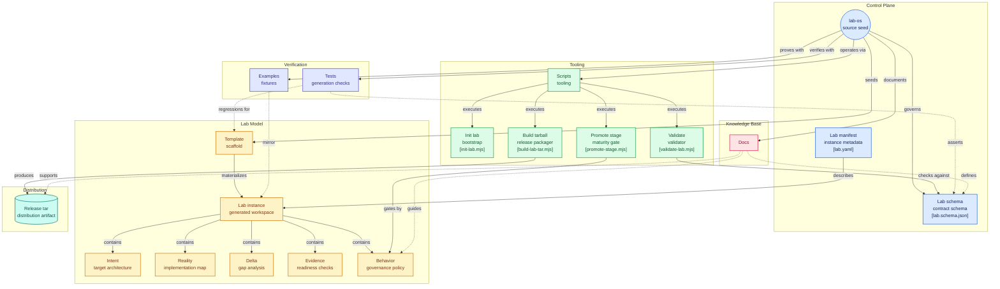

---
created: 2026-03-31
updated: 2026-03-31
---

```mermaid
flowchart TD

subgraph group_control["Control Plane"]
  node_root(("lab-os<br/>source seed"))
  node_lab_yaml["Lab manifest<br/>instance metadata<br/>[lab.yaml]"]
  node_schema["Lab schema<br/>contract schema<br/>[lab.schema.json]"]
end

subgraph group_lab_model["Lab Model"]
  node_template["Template<br/>scaffold"]
  node_lab_instance["Lab instance<br/>generated workspace"]
  node_intent["Intent<br/>target architecture"]
  node_reality["Reality<br/>implementation map"]
  node_delta["Delta<br/>gap analysis"]
  node_evidence["Evidence<br/>readiness checks"]
  node_behavior["Behavior<br/>governance policy"]
end

subgraph group_tooling["Tooling"]
  node_scripts["Scripts<br/>tooling"]
  node_init_lab["Init lab<br/>bootstrap<br/>[init-lab.mjs]"]
  node_validate_lab["Validate<br/>validator<br/>[validate-lab.mjs]"]
  node_promote_stage["Promote stage<br/>maturity gate<br/>[promote-stage.mjs]"]
  node_build_tar["Build tarball<br/>release packager<br/>[build-lab-tar.mjs]"]
end

subgraph group_knowledge["Knowledge Base"]
  node_docs["Docs"]
end

subgraph group_verification["Verification"]
  node_examples["Examples<br/>fixtures"]
  node_tests["Tests<br/>generation checks"]
end

subgraph group_distribution["Distribution"]
  node_release_tar[("Release tar<br/>distribution artifact")]
end

node_root -->|"seeds"| node_template
node_root -->|"governs"| node_schema
node_root -->|"operates via"| node_scripts
node_root -->|"documents"| node_docs
node_root -->|"proves with"| node_examples
node_root -->|"verifies with"| node_tests
node_template -->|"materializes"| node_lab_instance
node_lab_yaml -->|"describes"| node_lab_instance
node_lab_instance -->|"contains"| node_intent
node_lab_instance -->|"contains"| node_reality
node_lab_instance -->|"contains"| node_delta
node_lab_instance -->|"contains"| node_evidence
node_lab_instance -->|"contains"| node_behavior
node_scripts -->|"executes"| node_init_lab
node_scripts -->|"executes"| node_validate_lab
node_scripts -->|"executes"| node_promote_stage
node_scripts -->|"executes"| node_build_tar
node_validate_lab -->|"checks against"| node_schema
node_promote_stage -->|"gates by"| node_behavior
node_build_tar -->|"produces"| node_release_tar
node_examples -.->|"mirror"| node_lab_instance
node_tests -.->|"regressions for"| node_template
node_tests -.->|"asserts"| node_schema
node_docs -.->|"defines"| node_schema
node_docs -.->|"guides"| node_behavior
node_docs -.->|"supports"| node_release_tar

click node_lab_yaml "https://github.com/JasonCheroske/Lab-OS/blob/main/lab.yaml"
click node_schema "https://github.com/JasonCheroske/Lab-OS/blob/main/schema/lab.schema.json"
click node_template "https://github.com/JasonCheroske/Lab-OS/tree/main/template"
click node_lab_instance "https://github.com/JasonCheroske/Lab-OS/tree/main/lab"
click node_intent "https://github.com/JasonCheroske/Lab-OS/tree/main/lab/intent"
click node_reality "https://github.com/JasonCheroske/Lab-OS/tree/main/lab/reality"
click node_delta "https://github.com/JasonCheroske/Lab-OS/tree/main/lab/delta"
click node_evidence "https://github.com/JasonCheroske/Lab-OS/tree/main/lab/evidence"
click node_behavior "https://github.com/JasonCheroske/Lab-OS/tree/main/lab/behavior"
click node_scripts "https://github.com/JasonCheroske/Lab-OS/tree/main/scripts"
click node_init_lab "https://github.com/JasonCheroske/Lab-OS/blob/main/scripts/init-lab.mjs"
click node_validate_lab "https://github.com/JasonCheroske/Lab-OS/blob/main/scripts/validate-lab.mjs"
click node_promote_stage "https://github.com/JasonCheroske/Lab-OS/blob/main/scripts/promote-stage.mjs"
click node_build_tar "https://github.com/JasonCheroske/Lab-OS/blob/main/scripts/build-lab-tar.mjs"
click node_docs "https://github.com/JasonCheroske/Lab-OS/tree/main/docs"
click node_examples "https://github.com/JasonCheroske/Lab-OS/tree/main/examples"
click node_tests "https://github.com/JasonCheroske/Lab-OS/blob/main/tests/generation.test.mjs"

classDef toneNeutral fill:#f8fafc,stroke:#334155,stroke-width:1.5px,color:#0f172a
classDef toneBlue fill:#dbeafe,stroke:#2563eb,stroke-width:1.5px,color:#172554
classDef toneAmber fill:#fef3c7,stroke:#d97706,stroke-width:1.5px,color:#78350f
classDef toneMint fill:#dcfce7,stroke:#16a34a,stroke-width:1.5px,color:#14532d
classDef toneRose fill:#ffe4e6,stroke:#e11d48,stroke-width:1.5px,color:#881337
classDef toneIndigo fill:#e0e7ff,stroke:#4f46e5,stroke-width:1.5px,color:#312e81
classDef toneTeal fill:#ccfbf1,stroke:#0f766e,stroke-width:1.5px,color:#134e4a
class node_root,node_lab_yaml,node_schema toneBlue
class node_template,node_lab_instance,node_intent,node_reality,node_delta,node_evidence,node_behavior toneAmber
class node_scripts,node_init_lab,node_validate_lab,node_promote_stage,node_build_tar toneMint
class node_docs toneRose
class node_examples,node_tests toneIndigo
class node_release_tar toneTeal
```