# Lab architecture flowchart

Living map of this repository’s **control plane**, **lab model**, **tooling**, **docs**, **verification**, and **distribution**. Regenerate or refine with the Cursor skill **`/flow-diagram`** ([.ai/.cursor/skills/flow-diagram/SKILL.md](../../.ai/.cursor/skills/flow-diagram/SKILL.md)).

**Navigation:** Cursor’s Markdown preview usually **does not** make Mermaid `click` targets interactive. Use the **node lookup** and **relationship lookup** tables below after the diagram—links use the same `blob` / `tree` routes as github.com. Base URL: [`https://github.com/JasonCheroske/Lab-OS`](https://github.com/JasonCheroske/Lab-OS) on branch `main`. After renaming the remote or default branch, update the table links and this paragraph to match `git remote get-url origin`.

**Style reference** (gitdiagram export, uses ` ` there): [EXAMPLE_FLOWCHART.md](EXAMPLE_FLOWCHART.md). **This file** uses **middle-dot** single-line labels so Cursor’s preview does not show raw HTML.

**Compact canvas:** The diagram uses **short node text** (files and one-word roles where possible); **Node lookup** has full descriptions. Mermaid `useMaxWidth` helps the chart fit the preview pane; two **stacked rows** inside Tooling and lab facets reduce how wide the graph grows.

```mermaid
%%{init: {'flowchart': {'useMaxWidth': true}, 'themeVariables': {'fontSize': '12px'}}}%%
flowchart TD

subgraph group_control["Control Plane"]
  direction TB
  node_root(("lab-os seed"))
  node_lab_yaml["lab.yaml · manifest"]
  node_schema["lab.schema.json"]
end

subgraph group_knowledge["Knowledge Base"]
  direction TB
  node_docs["docs/"]
end

subgraph group_verification["Verification"]
  direction TB
  node_examples["examples/"]
  node_tests["tests/"]
end

subgraph group_lab_model["Lab Model"]
  direction TB
  node_template["template/"]
  node_lab_instance["lab/ · workspace"]
  subgraph group_lab_facets["lab/ facets"]
    direction TB
    subgraph lab_f_row1[" "]
      direction LR
      node_intent["Intent"]
      node_reality["Reality"]
      node_delta["Delta"]
    end
    subgraph lab_f_row2[" "]
      direction LR
      node_evidence["Evidence"]
      node_behavior["Behavior"]
    end
  end
end

subgraph group_tooling["Tooling"]
  direction TB
  node_scripts["scripts/"]
  subgraph tool_row1[" "]
    direction LR
    node_init_lab["init-lab.mjs"]
    node_validate_lab["validate-lab.mjs"]
    node_promote_stage["promote-stage.mjs"]
  end
  subgraph tool_row2[" "]
    direction LR
    node_build_tar["build-lab-tar.mjs"]
    node_lab_init["lab-init.mjs"]
    node_lab_verify["lab-verify.mjs"]
  end
end

subgraph group_distribution["Distribution"]
  direction TB
  node_release_tar[("release tar")]
end

node_root -->|"seeds"| node_template
node_root -->|"governs"| node_schema
node_root -->|"operates via"| node_scripts
node_root -->|"documents"| node_docs
node_root -->|"proves with"| node_examples
node_root -->|"verifies with"| node_tests
node_template -->|"materializes"| node_lab_instance
node_lab_yaml -->|"describes"| node_lab_instance
node_lab_instance -->|"contains"| node_intent
node_lab_instance -->|"contains"| node_reality
node_lab_instance -->|"contains"| node_delta
node_lab_instance -->|"contains"| node_evidence
node_lab_instance -->|"contains"| node_behavior
node_scripts -->|"executes"| node_init_lab
node_scripts -->|"executes"| node_validate_lab
node_scripts -->|"executes"| node_promote_stage
node_scripts -->|"executes"| node_build_tar
node_scripts -->|"executes"| node_lab_init
node_scripts -->|"executes"| node_lab_verify
node_validate_lab -->|"checks against"| node_schema
node_promote_stage -->|"gates by"| node_behavior
node_build_tar -->|"produces"| node_release_tar
node_examples -.->|"mirror"| node_lab_instance
node_tests -.->|"regressions for"| node_template
node_tests -.->|"asserts"| node_schema
node_docs -.->|"defines"| node_schema
node_docs -.->|"guides"| node_behavior
node_docs -.->|"supports"| node_release_tar

classDef toneNeutral fill:#f8fafc,stroke:#334155,stroke-width:1.5px,color:#0f172a
classDef toneBlue fill:#dbeafe,stroke:#2563eb,stroke-width:1.5px,color:#172554
classDef toneAmber fill:#fef3c7,stroke:#d97706,stroke-width:1.5px,color:#78350f
classDef toneMint fill:#dcfce7,stroke:#16a34a,stroke-width:1.5px,color:#14532d
classDef toneRose fill:#ffe4e6,stroke:#e11d48,stroke-width:1.5px,color:#881337
classDef toneIndigo fill:#e0e7ff,stroke:#4f46e5,stroke-width:1.5px,color:#312e81
classDef toneTeal fill:#ccfbf1,stroke:#0f766e,stroke-width:1.5px,color:#134e4a
class node_root,node_lab_yaml,node_schema toneBlue
class node_template,node_lab_instance,node_intent,node_reality,node_delta,node_evidence,node_behavior toneAmber
class node_scripts,node_init_lab,node_validate_lab,node_promote_stage,node_build_tar,node_lab_init,node_lab_verify toneMint
class node_docs toneRose
class node_examples,node_tests toneIndigo
class node_release_tar toneTeal
```

## Node lookup

| Mermaid ID | Role | Repo path | On GitHub |
|------------|------|-----------|-----------|
| `node_root` | Product root | (concept) | [Repository](https://github.com/JasonCheroske/Lab-OS) |
| `node_lab_yaml` | Lab manifest | `lab.yaml` | [lab.yaml](https://github.com/JasonCheroske/Lab-OS/blob/main/lab.yaml) |
| `node_schema` | JSON Schema | `schema/lab.schema.json` | [lab.schema.json](https://github.com/JasonCheroske/Lab-OS/blob/main/schema/lab.schema.json) |
| `node_template` | Scaffold | `template/` | [template/](https://github.com/JasonCheroske/Lab-OS/tree/main/template) |
| `node_lab_instance` | Meta-lab workspace | `lab/` | [lab/](https://github.com/JasonCheroske/Lab-OS/tree/main/lab) |
| `node_intent` | Target architecture | `lab/intent/` | [lab/intent/](https://github.com/JasonCheroske/Lab-OS/tree/main/lab/intent) |
| `node_reality` | Implementation map | `lab/reality/` | [lab/reality/](https://github.com/JasonCheroske/Lab-OS/tree/main/lab/reality) |
| `node_delta` | Gap analysis | `lab/delta/` | [lab/delta/](https://github.com/JasonCheroske/Lab-OS/tree/main/lab/delta) |
| `node_evidence` | Readiness checks | `lab/evidence/` | [lab/evidence/](https://github.com/JasonCheroske/Lab-OS/tree/main/lab/evidence) |
| `node_behavior` | Governance policy | `lab/behavior/` | [lab/behavior/](https://github.com/JasonCheroske/Lab-OS/tree/main/lab/behavior) |
| `node_scripts` | Tooling entry | `scripts/` | [scripts/](https://github.com/JasonCheroske/Lab-OS/tree/main/scripts) |
| `node_init_lab` | Bootstrap | `scripts/init-lab.mjs` | [init-lab.mjs](https://github.com/JasonCheroske/Lab-OS/blob/main/scripts/init-lab.mjs) |
| `node_validate_lab` | Validator | `scripts/validate-lab.mjs` | [validate-lab.mjs](https://github.com/JasonCheroske/Lab-OS/blob/main/scripts/validate-lab.mjs) |
| `node_promote_stage` | Maturity gate | `scripts/promote-stage.mjs` | [promote-stage.mjs](https://github.com/JasonCheroske/Lab-OS/blob/main/scripts/promote-stage.mjs) |
| `node_build_tar` | Release packager | `scripts/build-lab-tar.mjs` | [build-lab-tar.mjs](https://github.com/JasonCheroske/Lab-OS/blob/main/scripts/build-lab-tar.mjs) |
| `node_lab_init` | Sprout helper | `scripts/lab-init.mjs` | [lab-init.mjs](https://github.com/JasonCheroske/Lab-OS/blob/main/scripts/lab-init.mjs) |
| `node_lab_verify` | Workspace checks | `scripts/lab-verify.mjs` | [lab-verify.mjs](https://github.com/JasonCheroske/Lab-OS/blob/main/scripts/lab-verify.mjs) |
| `node_docs` | Documentation | `docs/` | [docs/](https://github.com/JasonCheroske/Lab-OS/tree/main/docs) |
| `node_examples` | Fixtures | `examples/` | [examples/](https://github.com/JasonCheroske/Lab-OS/tree/main/examples) |
| `node_tests` | Generation checks | `tests/generation.test.mjs` | [generation.test.mjs](https://github.com/JasonCheroske/Lab-OS/blob/main/tests/generation.test.mjs) |
| `node_release_tar` | Distribution artifact | (output) | — |

## Relationship lookup

Solid lines are primary flows; dotted lines are supporting or indirect.

| From | Relationship | To | Style |
|------|----------------|-----|--------|
| `node_root` | seeds | `node_template` | solid |
| `node_root` | governs | `node_schema` | solid |
| `node_root` | operates via | `node_scripts` | solid |
| `node_root` | documents | `node_docs` | solid |
| `node_root` | proves with | `node_examples` | solid |
| `node_root` | verifies with | `node_tests` | solid |
| `node_template` | materializes | `node_lab_instance` | solid |
| `node_lab_yaml` | describes | `node_lab_instance` | solid |
| `node_lab_instance` | contains | `node_intent` | solid |
| `node_lab_instance` | contains | `node_reality` | solid |
| `node_lab_instance` | contains | `node_delta` | solid |
| `node_lab_instance` | contains | `node_evidence` | solid |
| `node_lab_instance` | contains | `node_behavior` | solid |
| `node_scripts` | executes | `node_init_lab` | solid |
| `node_scripts` | executes | `node_validate_lab` | solid |
| `node_scripts` | executes | `node_promote_stage` | solid |
| `node_scripts` | executes | `node_build_tar` | solid |
| `node_scripts` | executes | `node_lab_init` | solid |
| `node_scripts` | executes | `node_lab_verify` | solid |
| `node_validate_lab` | checks against | `node_schema` | solid |
| `node_promote_stage` | gates by | `node_behavior` | solid |
| `node_build_tar` | produces | `node_release_tar` | solid |
| `node_examples` | mirror | `node_lab_instance` | dotted |
| `node_tests` | regressions for | `node_template` | dotted |
| `node_tests` | asserts | `node_schema` | dotted |
| `node_docs` | defines | `node_schema` | dotted |
| `node_docs` | guides | `node_behavior` | dotted |
| `node_docs` | supports | `node_release_tar` | dotted |
