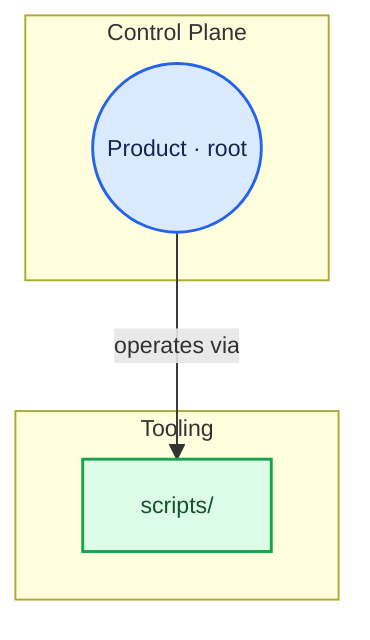

# Flow diagram — examples

## User prompts (apply the skill)

- “`/flow-diagram` refresh” or “`/flow-driagram`” (typo — treat as this skill).
- “Update the architecture Mermaid to match the repo.”
- “Sync `LAB_ARCHITECTURE_FLOWCHART.md` after we moved scripts / added `lab/` folders.”
- “GitDiagram-style flowchart for Lab OS, committed in docs.”
- “Create `docs/architecture/SYSTEM_MAP.md` with the house style.”

## Deliverable shape (canonical doc)

1. H1 title and short intro (living diagram, pointer to this skill, why **tables** replace `click` in Cursor).
2. One fenced code block, language `mermaid`: `flowchart TD`, `%%{init:...}%%`, subgraphs, edges, **full `classDef` / `class`** (see skeleton below), **no `click` lines**.
3. **Node lookup** table: Mermaid ID, role, repo path, GitHub link (`blob` / `tree`).
4. **Relationship lookup** table: from, relationship, to, solid vs dotted.
5. Optionally **What changed** bullets for PRs.

Inner diagram structure: subgraphs with `group_*` IDs, nodes with `node_*` IDs. **Match the maintained canonical chart** — [LAB_ARCHITECTURE_FLOWCHART.md](https://github.com/JasonCheroske/Lab-OS/blob/main/lab-os-lab/docs/60-reference/LAB_ARCHITECTURE_FLOWCHART.md) — for layout, colors, and compact **` · `** labels. Do **not** mimic [EXAMPLE_FLOWCHART.md](https://github.com/JasonCheroske/Lab-OS/blob/main/lab-os-lab/docs/60-reference/EXAMPLE_FLOWCHART.md) multiline `<br/>` labels or **`click`** in the canonical doc.

## Full gitdiagram palette (copy-paste)

Use this block as the default styling layer. Map nodes to tones by concern (control/schema → blue; core domain/lab → amber; tooling → mint; docs → rose; tests/examples → indigo; artifacts → teal; optional neutral for uncategorized). **Omit unused `classDef` lines only** when the diagram has very few nodes and a reduced palette is intentional.

```text
classDef toneNeutral fill:#f8fafc,stroke:#334155,stroke-width:1.5px,color:#0f172a
classDef toneBlue fill:#dbeafe,stroke:#2563eb,stroke-width:1.5px,color:#172554
classDef toneAmber fill:#fef3c7,stroke:#d97706,stroke-width:1.5px,color:#78350f
classDef toneMint fill:#dcfce7,stroke:#16a34a,stroke-width:1.5px,color:#14532d
classDef toneRose fill:#ffe4e6,stroke:#e11d48,stroke-width:1.5px,color:#881337
classDef toneIndigo fill:#e0e7ff,stroke:#4f46e5,stroke-width:1.5px,color:#312e81
classDef toneTeal fill:#ccfbf1,stroke:#0f766e,stroke-width:1.5px,color:#134e4a
```

Then assign classes (example — adjust IDs to match your nodes):

```text
class node_root,node_lab_yaml,node_schema toneBlue
class node_template,node_lab_instance toneAmber
class node_scripts,node_init_lab toneMint
class node_docs toneRose
class node_examples,node_tests toneIndigo
class node_release_tar toneTeal
```

## Mermaid skeleton (expand from inventory)

Paste **`classDef` / `class` lines inside the `mermaid` fence** (not in a separate text block). Minimal structure:



After the fence, add lookup table rows for each node (path + `https://github.com/OWNER/REPO/tree/main/...` or `blob/...`).

Resolve `OWNER`, `REPO`, and `main` from `git remote get-url origin` (or user override).

## Anti-patterns

- Relying on Mermaid **`click`** as the only navigation in the canonical doc (breaks in Cursor).
- Imitating **EXAMPLE_FLOWCHART** `<br/>` stacks or **`click`** for the canonical file.
- Inventing directories not in the tree to “look complete”.
- Using node IDs with spaces (`node validate` → use `node_validate`).
- Putting secrets in labels or URLs (tokens in query strings).

## Reference output

- Historical gitdiagram export ( **`click`** + `<br/>` ): [EXAMPLE_FLOWCHART.md](https://github.com/JasonCheroske/Lab-OS/blob/main/lab-os-lab/docs/60-reference/EXAMPLE_FLOWCHART.md).
- Maintained canonical (tables + no `click`, compact labels): [LAB_ARCHITECTURE_FLOWCHART.md](https://github.com/JasonCheroske/Lab-OS/blob/main/lab-os-lab/docs/60-reference/LAB_ARCHITECTURE_FLOWCHART.md).
