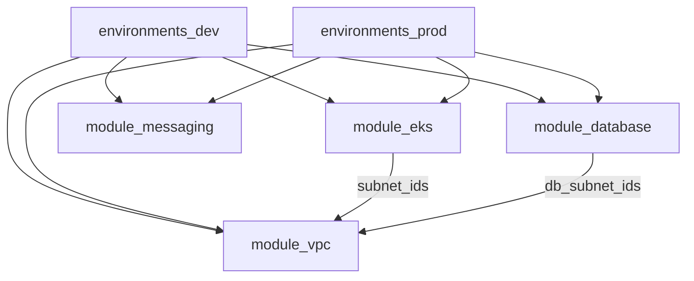

# Dependency map

**Output chaining**

- `vpc` → subnet IDs → `eks`, `database`
- `messaging` → `queue_url` / `queue_arn` → consumed by workloads (Kubernetes manifests or app config; environment can expose via outputs)

**Bootstrap**

- `_bootstrap` has **no** module dependencies; creates state storage only.
